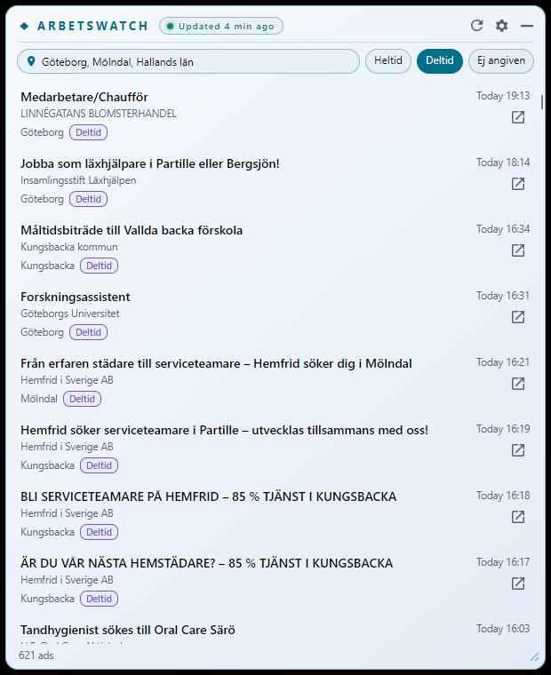

# ArbetsWatch

A Windows-first desktop app that keeps a local, filterable view of the job ads currently published on Platsbanken, using Arbetsförmedlingen's public JobTech APIs. Built with C#, .NET 10 and Avalonia; the shared core stays portable for later macOS/Linux builds.

> **Status: in development (v0.1).** See [docs/progress.md](docs/progress.md) for what works and what has been verified.



## How it works

- On first start, ArbetsWatch downloads the complete JobStream snapshot (≈ 450 MB, about a minute on a fast connection) and keeps a compact summary of every current ad in a local SQLite database.
- It then polls the JobStream change feed (default every 5 minutes) and applies new, changed and removed ads.
- Filtering by län, kommun and worktime (Heltid, Deltid, not specified) happens locally, so changing filters is instant and works offline.
- "New" means newly detected by this monitor while it was running, not necessarily newly published.

No account or API key is needed. Data stays on your PC in `%LOCALAPPDATA%\ArbetsWatch`.

## Build

Requires the .NET 10 SDK.

```powershell
dotnet restore ArbetsWatch.slnx --locked-mode
dotnet build ArbetsWatch.slnx --configuration Release --no-restore
dotnet test ArbetsWatch.slnx --configuration Release --no-build --no-restore
```

## Repository layout

| Path | Contents |
|---|---|
| `src/ArbetsWatch.Core` | Models, matching rules, synchronization, HTTP adapters, SQLite persistence, bundled geography. No UI dependency. |
| `src/ArbetsWatch.Desktop` | Avalonia views, view models, tray and window integration. |
| `tests/ArbetsWatch.Core.Tests` | Deterministic unit and SQLite tests with sanitized fixtures. |
| `tools/TaxonomyExport` | Regenerates `src/ArbetsWatch.Core/Places/places.json` from the Taxonomy API. |
| `docs/api-contracts.md` | Verified API behavior and open questions. |
| `docs/progress.md` | Milestone status and validation evidence. |

## Regenerating the geography

```powershell
dotnet run --project tools/TaxonomyExport
```

The tool pins the latest taxonomy version and stops if the region or municipality count differs from the expected 21/290.
